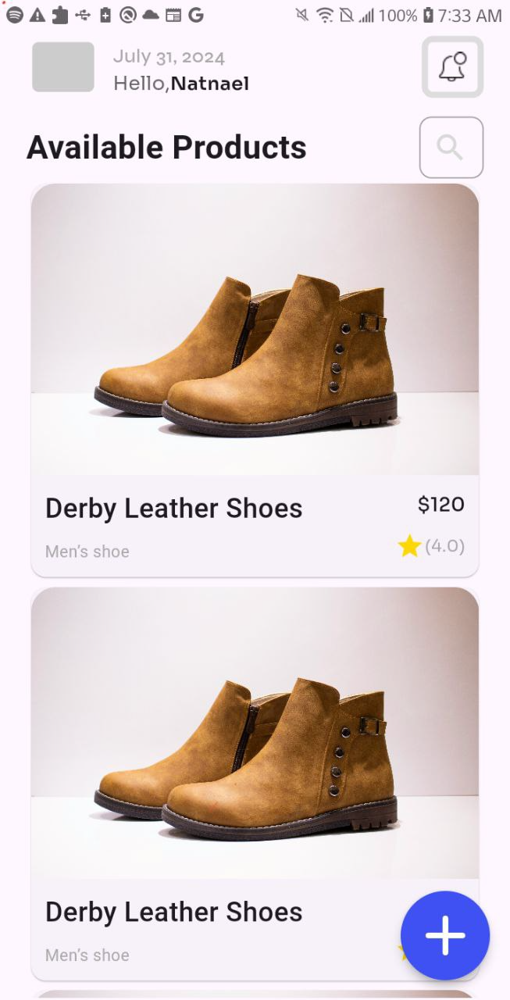
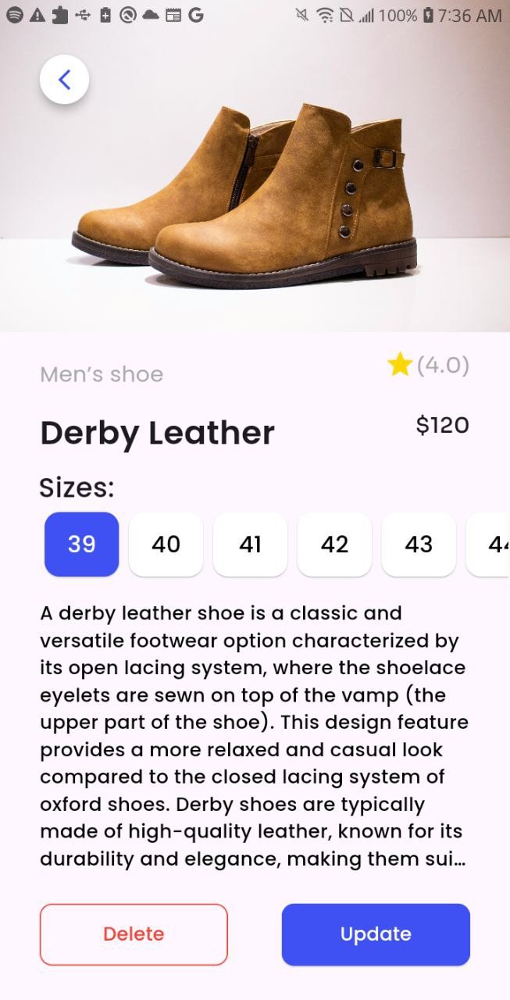
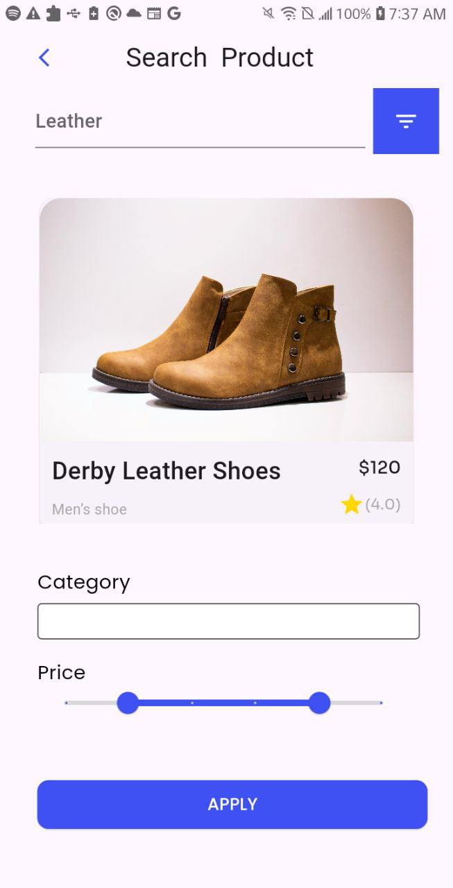

# Ecommerce-Flutter-App

Here's the content formatted in markdown:

# Flutter UI Design Project

This is a Flutter project that implements a UI design and utilizes the Google Fonts package.

## Table of Contents

- [Getting Started](#getting-started)
  - [Prerequisites](#prerequisites)
  - [Installation](#installation)
- [Usage](#usage)
- [Features](#features)
- [Contributing](#contributing)
- [License](#license)
- [Contact](#contact)

## Getting Started

These instructions will help you set up the project on your local machine for development and testing purposes.

### Prerequisites

Before you begin, ensure you have met the following requirements:

- You have installed the latest version of [Flutter](https://flutter.dev/docs/get-started/install)
- You have a [Google Fonts API key](https://developers.google.com/fonts/docs/developer_api)
- You have a code editor like [Visual Studio Code](https://code.visualstudio.com/) or [Android Studio](https://developer.android.com/studio)

### Installation

1. Clone the repo
   ```sh
   git clone https://github.com/nina17arse/2024-internship-mobile-tasks/tree/main/mobile/natnael_wondwoesn
   ```
2. Navigate to the project directory
   ```sh
   cd flutter-ui-design
   ```
3. Install the dependencies
   ```sh
   flutter pub get
   ```

## Usage

Run the app

```sh
flutter run
```

The app will be launched on your connected device or emulator.

## Features

- Implements a beautiful UI design.
- Utilizes the Google Fonts package for custom fonts.
- Responsive layout for different screen sizes.
## Updates on August 8 2024
Completed Tasks
Task 9: Domain Layer of Flutter Project

Completed the implementation of the domain layer.
Successfully performed all CRUD operations tests for the domain layer.
Task 10: Domain Layer Enhancements

Completed two sub-tasks:
Implemented the fromJson method.
Implemented the toJson method.
Conducted and passed respective tests for both fromJson and toJson methods.

## Contributing

Contributions are what make the open-source community such an amazing place to be learn, inspire, and create. Any contributions you make are greatly appreciated.

To contribute:

1. Fork the Project
2. Create your Feature Branch (`git checkout -b feature/AmazingFeature`)
3. Commit your Changes (`git commit -m 'Add some AmazingFeature'`)
4. Push to the Branch (`git push origin feature/AmazingFeature`)
5. Open a Pull Request

## License

Distributed under the MIT License. See `LICENSE` for more information.

## Contact

Your Name - [@your_twitter](https://twitter.com/your_twitter) - ninatina423@gmail.com










